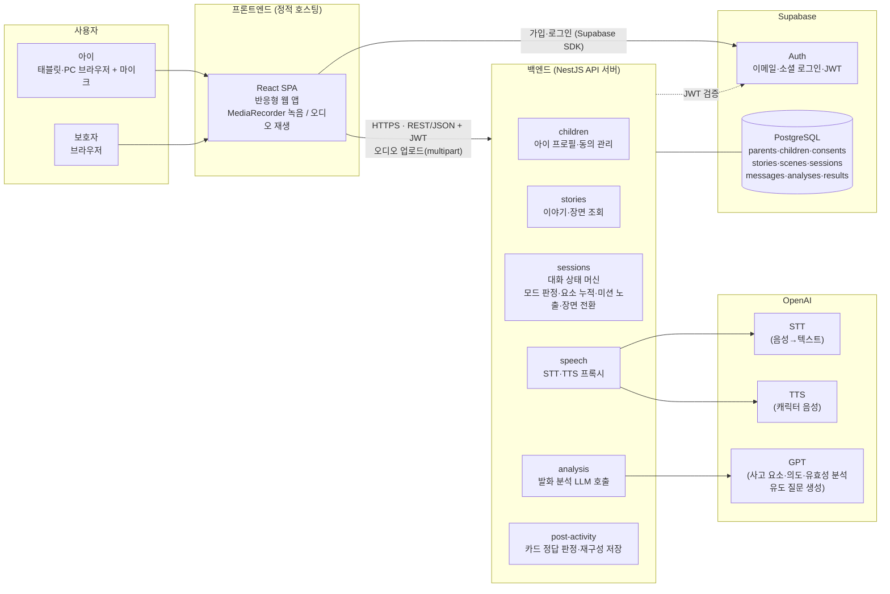
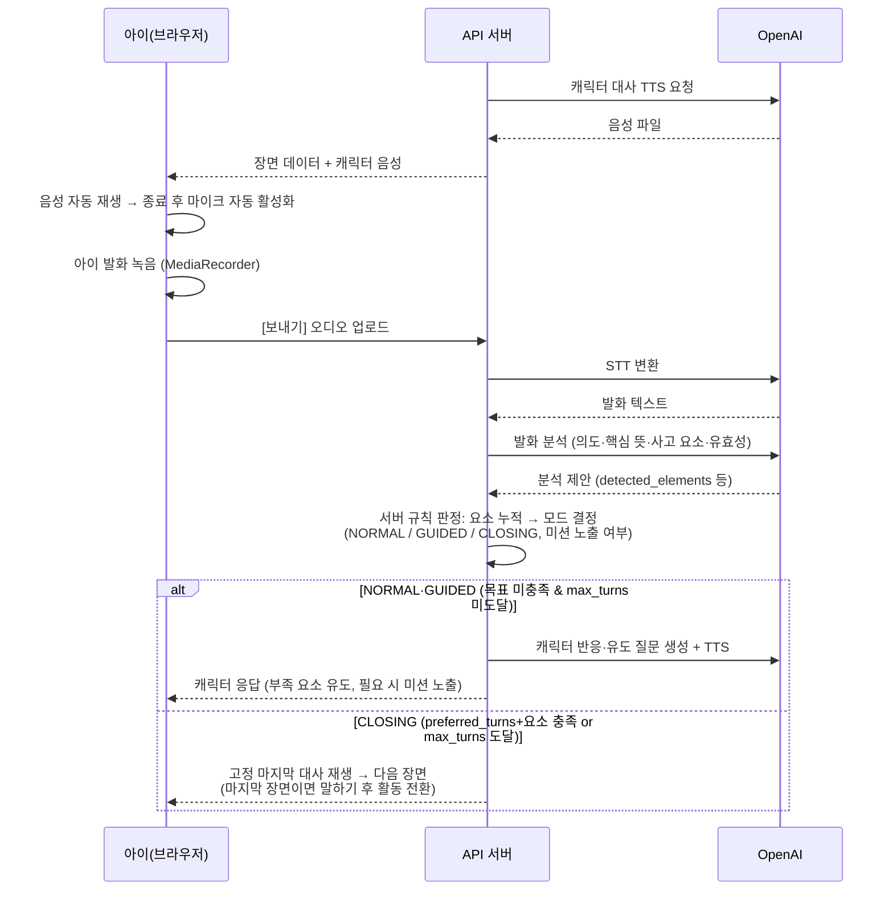
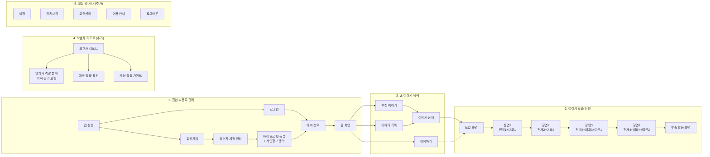

# 굿퀘스천 — 시스템 구성도

## 핵심 시퀀스: 한 턴의 대화 (FR-04 ~ FR-06)

## 화면 흐름 (팀 화면 흐름도 반영)

- 이어하기는 `story_sessions.current_scene_id` + `last_activity_at` 기준으로 중단 지점의 장면으로 직행.
- 장면 화면은 태블릿 가로 기준 좌(전개 스토리)/우(대화) 분할, 순차 활성화.

## 배포 구성 (안)

| 구성 요소 | 배포 위치 | 비고 |
|---|---|---|
| React SPA | Vercel/Netlify 정적 배포 또는 API 서버에서 함께 서빙 | 후자는 CORS 불필요, 구성 단순 |
| NestJS API | Render/Railway/Fly.io 등 PaaS 1 인스턴스 | HTTPS 기본 제공 |
| Auth + PostgreSQL | Supabase | 팀 DB안 전제 (`parents.id` = `auth.users.id`) |
| OpenAI API 키 | 서버 환경변수로만 보관 | 클라이언트 노출 금지 |
