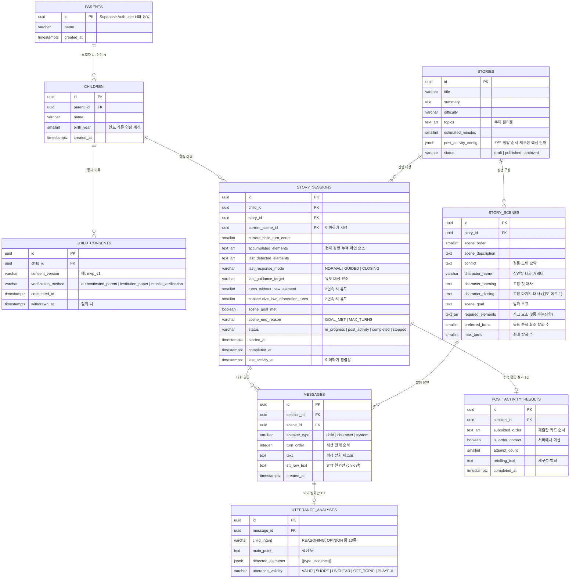

# 굿퀘스천 — 데이터 모델 (ERD)

> 기준: 팀 노션 「DB 구조_260803_수정안」. 이 문서는 해당 수정안을 ERD로 옮긴 것이며,
> 원문과 다르게 해석한 부분·발견된 모순은 하단 "검토 메모"에 기록.

## 확장 테이블 (MVP 구현 대상 아님 — 추가 요건용)

| 테이블 | 용도 | 비고 |
|---|---|---|
| `reports` | 보호자 리포트 (summary, strengths, next_focus) | FR-08 구현 시 생성. 대표 발화는 messages에서 조회. 화면 흐름도 기준 리포트 구성: 말하기 역량 분석(어휘·논리·표현) / 대표 발화 확인 / 가정 학습 가이드 |
| `analysis_versions` | 분석 모델·프롬프트 버전 관리 | MVP는 `utterance_analyses`에 버전 문자열(mvp_v1)만으로 충분 |
| `wordbook` | 단어장 (word, meaning, source_scene_id) | FR-09 구현 시 생성 |

## 핵심 규칙 (DB 수정안에서 발췌)

- **인증**: 이메일·비밀번호·로그인은 Supabase Auth가 관리. `parents.id` = `auth.users.id` (별도 auth_user_id 없음)
- **원본 음성 미저장**: STT 확정 텍스트(`text`)와 STT 원변환(`stt_raw_text`)만 저장. STT 실패 시 메시지 자체를 생성하지 않음
- **동의 없으면 세션 시작 불가**: `child_consents` 미존재/철회 아이는 새 이야기 세션 시작 불가
- **missing_elements는 저장하지 않음** — `required_elements − accumulated_elements`로 서버가 계산
- **분석 LLM의 역할 제한**: LLM은 child_intent, main_point, detected_elements, utterance_validity만 제안. 목표 충족·응답 모드·종료 이유는 **서버 규칙으로 확정**
- **카드 정답 판정은 서버**가 계산 (프런트 아님). 카드·정답 순서는 `stories.post_activity_config`에서 로드
- **사고 요소 8종**: DECISION, REASON, PERSPECTIVE, SOLUTION, RESULT, EMOTION, EMPATHY, REQUEST — 여러 발화에 걸쳐 누적 확인
- **콘텐츠 수정 정책**: 사용된 이야기는 직접 수정하지 않고 복사 후 새 story_id로 등록 (버전 테이블 없음)

## 검토 메모 (원문 모순 — 팀 확인 필요)

1. **character_closing 모순**: DB 수정안의 story_scenes 참고에는 "고정 마지막 대사는 두지 않는다. CLOSING 시 LLM이 마무리 대사를 생성"이라고 되어 있으나, 같은 문서의 utterance_analyses 참고에는 "CLOSING이 결정되면 LLM이 생성하지 않고 서버가 character_closing을 조회해 재생"이라고 정반대로 기술됨. **콘텐츠 문서(방귀 뀌는 며느리)는 장면마다 고정 마지막 대사를 실제 정의**하고 있으므로, 본 ERD는 `character_closing` 컬럼 유지(고정 대사 사용)를 기준으로 함.
2. **대화1 target_elements 불일치**: 장면 구성 테이블은 `["PERSPECTIVE","EMOTION","REASON","SOLUTION"]`, 화면별 상세는 `PERSPECTIVE, EMOTION, EXPRESSION, SOLUTION`. `EXPRESSION`은 허용 8종에 없는 값 — 오타로 추정.
3. **대화2 target_elements 불일치**: 장면 구성 테이블은 `["PERSPECTIVE","EMOTION","REASON","SOLUTION"]`, 화면별 상세는 `PERSPECTIVE, EMPATHY, REASON, REQUEST`. 진행 흐름 설명(관점 이해→이유 설명→이해 요청)은 후자와 일치 — 후자가 맞을 가능성 높음.
